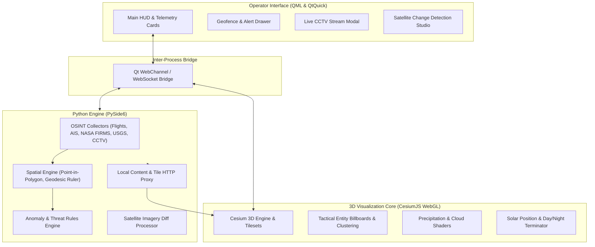

# MAVEN: Open-Source Geospatial Intelligence & Planetary Monitoring Platform


**Maven** is an open-source geospatial intelligence and planetary monitoring system that unites high-resolution 3D planetary rendering with live OSINT telemetry feeds. Designed with an adversarial operations center HUD aesthetic, Maven enables live tracking of air traffic, maritime routes, thermal anomalies, seismic activity, CCTV camera feeds, and automated satellite change detection.

---

## Capabilities

- **Multi-Resolution 3D Planetary Engine**: Continuous zoom from orbital vantage points down to street-level 3D buildings without reloading scenes.
- **Cesium 3D Tiles & Terrain Streaming**: Real elevation models, OpenStreetMap 3D buildings, and Overture Maps data.
- **Real-Time OSINT Data Feeds**:
  - **Live Air Traffic**: OpenSky Network and ADS-B feeds tracking thousands of global flights with heading-oriented vector markers.
  - **Maritime Traffic**: Global AIS vessel tracking across key nautical chokepoints (Malacca, Suez, Hormuz, Panama, English Channel).
  - **Thermal Anomaly & Wildfire Detection**: NASA FIRMS satellite sensors (MODIS / VIIRS) monitoring active thermal fronts.
  - **Seismic Activity**: USGS real-time seismic event tracking with magnitude-scaled shockwave pulses.
  - **Live CCTV & Street Surveillance**: Over 1,500 live camera feeds (Transport for London JamCams, Caltrans Highway CCTV, NYC DOT) with real-time video/snapshot previews.
  - **Atmospheric Weather Vectors**: Open-Meteo live weather data with animated precipitation and cloud cover.
- **Spatial Geofencing & Zone Alarms**: Interactive polygon drawing with automated point-in-polygon breach detection.
- **Satellite Change Detection**: Optical multi-temporal diff analysis (Sentinel-2 / NASA GIBS) to detect new construction, deforestation, and flood expanses.
- **Autonomous Anomaly Detection**: Real-time identification of transponder dropouts, squawk 7700 emergencies, and high-risk thermal clusters rendered directly as pulsing beacons on the globe.
- **Geodesic Measurement Toolkit**: Calculation of great-circle distances, azimuth/bearing, and surface area.
- **Solar Lighting & Day/Night Terminator**: Realistic solar position computation and atmospheric scattering.

---

## System Architecture



---

## Installation and Execution

### Prerequisites
- Python 3.10+
- PySide6 6.6+

### Setup
```bash
# Clone the repository
git clone https://github.com/MaenExists/Maven.git
cd Maven

# Install dependencies
pip install -r requirements.txt

# Run Maven
python main.py
```

---

## License
Apache-2.0 License. See [LICENSE](file:///home/maen/Builds/Maven/LICENSE) for details.
